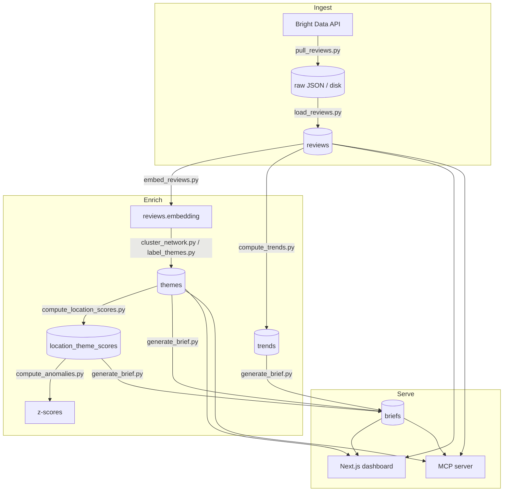

# Architecture

How Reviews Intelligence turns raw Google/Yelp reviews into per-location manager
briefs, and the engineering decisions behind each stage. For the database
schema see [`supabase/SCHEMA.md`](supabase/SCHEMA.md); for the evaluation
methodology see [`evals/README.md`](evals/README.md); for the alternatives,
pivots, and bugs behind these choices see [`DECISIONS.md`](DECISIONS.md).

## System overview

Each pipeline stage is a standalone `python -m scripts.<name>` job. Stages
communicate only through Postgres tables, so any stage can be re-run
independently and the dashboard/MCP server always read the latest committed
state.

## Design principles

These show up in every stage and are the most transferable part of the work:

- **Separate the expensive irreversible step from the cheap reversible one.**
  Scraping costs money; normalizing is free. So they're two scripts with raw
  JSON persisted between them — a normalizer bug never re-pays the vendor.
- **Every paid step is guarded.** A cost estimate prints before any spend, and
  `--dry-run` shows the estimate without calling anything.
- **Every write is idempotent.** Upserts on natural keys, NULL-only backfills,
  and a refuse-unless-`--replace` guard mean re-running a stage is always safe.
- **Resumability falls out of the data model**, not bespoke checkpointing. The
  embed job selects `WHERE embedding IS NULL`; a crash just resumes.
- **LLM output is never trusted on faith.** Quotes are validated against source
  text; semantic search returns honest empties; small samples are suppressed,
  not extrapolated.

## Stage 1 — Ingest (two-phase ELT)

`pull_reviews.py` + `lib/brightdata.py` → `load_reviews.py`

- **Phase A (pull):** one Bright Data trigger *per source* (not per location) —
  all verified store URLs go into a single Google job and a single Yelp job.
  The async pattern is trigger → poll `/progress` every 30s → download. Two
  real-world races are handled explicitly: per-URL failures are returned as
  error rows (`include_errors=true`) rather than failing the batch, and the
  known "`ready` before the snapshot is materialized" race is absorbed with a
  backoff retry. Raw output is written to `brightdata-raw/` and one audit row
  per snapshot to `raw_scrapes`. Volume is bounded by date window
  (`--years`, default 2), the only knob the scrapers accept.
- **Phase B (load):** pure normalization from disk — never touches the network.
  Records are matched to locations by the URL Bright Data echoes back; unmatched
  records are logged, not dropped silently. Reviews upsert on
  `(source, external_id)`; listing metadata upserts on `(location_id, source)`;
  the canonical Google address backfills only when currently NULL. Re-running is
  free and safe.

## Stage 2 — Embed

`embed_reviews.py` + `lib/openai.py`

- **Model:** OpenAI `text-embedding-3-large`, with the native 3072-dim output
  **truncated to 1536 dims** via the API's `dimensions` parameter. This keeps
  most of `-large`'s quality edge over `-small` while leaving the schema's
  `vector(1536)` column (and its HNSW cosine index) unchanged.
- **Selection:** `WHERE embedding IS NULL AND text IS NOT NULL`. Rating-only
  reviews (no text) are correctly never embedded — they account for exactly the
  reviews without vectors. The filter also makes the job resumable for free.
- **Robustness:** cursor-based pagination (`id > last_id`) instead of offset, so
  concurrent updates can't cause skips; batches of 250; one retry per embed
  call and up to two per row-update. A cost estimate (~$0.25 for the full ~19k)
  prints before spending.

## Stage 3 — Cluster

`lib/clustering.py`, driven by `cluster_network.py` (network scope) and
`label_themes.py` (per-location scope)

- **Rating-partitioned, two-pass KMeans.** Reviews are split by rating *before*
  clustering — 1–3★ form the **"actions"** pass, 4–5★ the **"working"** pass —
  and each pass is clustered separately. Why: KMeans minimizes global inertia,
  so under the real ~6:1 positive:negative imbalance a single pass spent almost
  all its clusters on praise and collapsed every complaint into one bucket.
  Giving each polarity its own cluster budget fixes that.
- KMeans runs directly on the 1536-dim vectors (no dimensionality reduction),
  with fixed `random_state` and `n_init=10`. `k` is configured per pass, not
  auto-selected — a deliberate simplification for a dataset this size.
- **Network clustering scales its noise floor with the network:** a theme must
  have at least ~1 review per active location (actions) or ~2 (working, because
  the positive pool is far larger) to survive, filtering generic-positive mass.
- Each surviving cluster becomes a `themes` row carrying its member review IDs,
  centroid-nearest representatives, prevalence, and average rating.

## Stage 4 — Label (multi-stage, Claude Haiku)

`lib/labeling.py` (model: `claude-haiku-4-5`, `temperature=0`, prompt caching)

Clusters are geometry; this stage turns them into named, evidence-backed themes
in three sequential passes — and aggressively refuses to over-claim:

1. **Candidate generation.** From 5 centroid-nearest reviews, Haiku proposes up
   to 3 "concrete practices." A candidate is only valid if it has a named
   subject, a concrete action, **and a verbatim evidence quote** proving both.
   Generic sentiment ("friendly staff") returns nothing.
2. **Distinctness selection.** Clusters are processed largest-first; each call
   sees the themes already chosen and either picks the most-distinct candidate
   or explicitly returns *none* — "false specificity is worse than honest
   overlap." A theme is marked `specific=true` only if a candidate survives.
3. **Supporting evidence.** For winning themes, Haiku returns up to 3 more
   quotes, **each validated as a substring of its named source review.** A
   tolerant fallback normalizes Unicode punctuation/whitespace, but no
   fuzzy/edit-distance matching is allowed — a paraphrase cannot pass.

This three-layer quote integrity (required at generation, validated at
extraction, re-enforced in the brief prompt) is the project's core defense
against LLM fabrication.

## Stage 5 — Score, anomaly, trend

- **`compute_location_scores.py`** builds the full location × theme matrix.
  Prevalence = (a location's reviews in a theme) / (that location's reviews in
  the same rating pass). The same-pass denominator keeps comparisons
  apples-to-apples. Every location gets a row for every theme, including 0.0.
- **`compute_anomalies.py`** computes a **robust z-score** per theme:
  `(prevalence − median) / IQR` across locations — median/IQR, not mean/std, so
  one extreme store doesn't distort the baseline. A **small-sample guard**
  leaves z-score and direction NULL unless the location's same-pass pool has ≥10
  reviews; a 50%-on-2-reviews store is noise, not a 3-sigma outlier, and the
  system says so by staying silent.
- **`compute_trends.py`** compares a recent 90-day window to the prior 90 days,
  for both overall rating and per-theme prevalence. Direction is **polarity-
  aware** (less of an *action* theme is "improving"; more of a *working* theme
  is "improving") with dead-bands to avoid calling noise, and a thin-window
  guard (both windows need ≥5 reviews) before any direction is assigned.

## Stage 6 — Brief generation

`generate_brief.py` + `lib/intelligence.py` (model: `claude-opus-4-7`)

- `intelligence.get_location_intelligence()` assembles a structured packet from
  the precomputed tables: location facts, local themes with their validated
  quotes, z-scored anomalies, overall and per-theme trends, and network context.
  It's pure assembly — no model call — so the brief is a single Opus call.
- **Raw-review fallback:** if a location has ≤2 *specific* action themes, the
  packet includes its worst raw 1–3★ reviews (excluding ones already used as
  cluster representatives), so a thin-signal store still gets an evidence-based
  brief. The same prompt handles both regimes.
- **Prompt discipline:** a strict-format system prompt with a "load-bearing
  quote" rule — no paraphrase, no composition, no invention; if there's no real
  quote, drop the point. Actions are prioritized by **frequency + scale, not
  severity alone**. Output is the brief only, in third person.
- **Cost is measured, not estimated:** the real `usage` from the API response is
  priced and stored in `briefs.cost_usd`. Re-running supersedes the prior active
  brief rather than deleting it.

## Stage 7 — Serving

- **Dashboard** (`src/`): Next.js App Router reading Supabase directly — network
  themes overview, per-location briefs, an anomaly heatmap, theme drill-downs.
- **MCP server** (`scripts/mcp_server.py`): FastMCP over stdio exposing 8
  read-only tools (locations, themes, semantic search, stats, brief, anomalies,
  recent reviews, theme prevalence). Tools are single-purpose, docstrings are
  written for the model, errors are raised (not enveloped) so the model can
  recover, and IDs accept either a UUID or a human `internal_id`.

### Deployment & transport (MCP)

The server runs as a **stdio subprocess** — Claude Desktop launches it and talks
over stdin/stdout. There is no network listener; this is the correct, standard
architecture for a single-user local agent surface.

Going remote is a deliberate next step, not a missing piece. FastMCP supports
Streamable HTTP with a near one-line change, but the real work is **auth**: the
server uses the Supabase service-role key (full access), which is fine for a
local subprocess and unacceptable on a public endpoint. A production deployment
would add OAuth 2.1 (or at minimum bearer-token auth), a long-lived host
(Fly.io/Render/Cloud Run), TLS, and host-level secrets — roughly half a day for
a token-gated demo, a few days for genuine production hardening.

## What I'd harden for production

This is a demo; the honest list of what's deliberately deferred:

- **Auth & multi-tenancy** — no login today; service-role access throughout.
- **Incremental ingestion** — the pipeline currently rebuilds from a static
  snapshot (the trend "today" is `max(posted_at)`); production would ingest on a
  schedule against `now()` and embed deltas only.
- **Cluster-count selection** — `k` is hand-tuned per pass; production would add
  silhouette/elbow selection or switch to a density-based method.
- **Backfill of edge cases** — owner responses, non-English reviews, and
  review-edit detection are out of scope for the demo.
- **Observability** — structured run logs and per-stage metrics beyond the
  current stderr logging and `raw_scrapes` audit table.

## Evaluation

The system is built to be *graded*, not eyeballed. Three locations (a
low-performer, a middling store, and a high-rated store with hidden problems)
were hand-labeled into ground-truth briefs before the generator was written, so
generated briefs can be compared against a human reference. See
[`evals/README.md`](evals/README.md).
