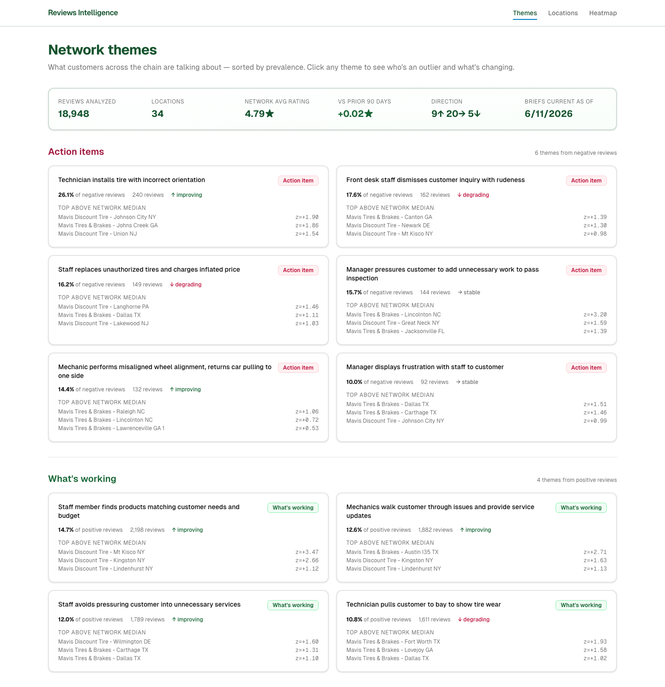
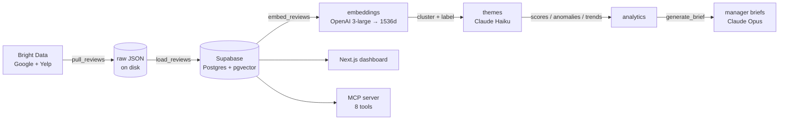
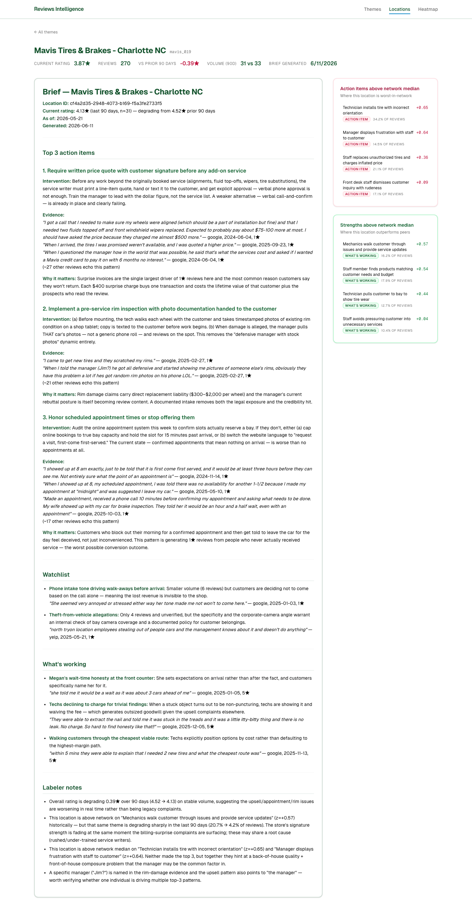
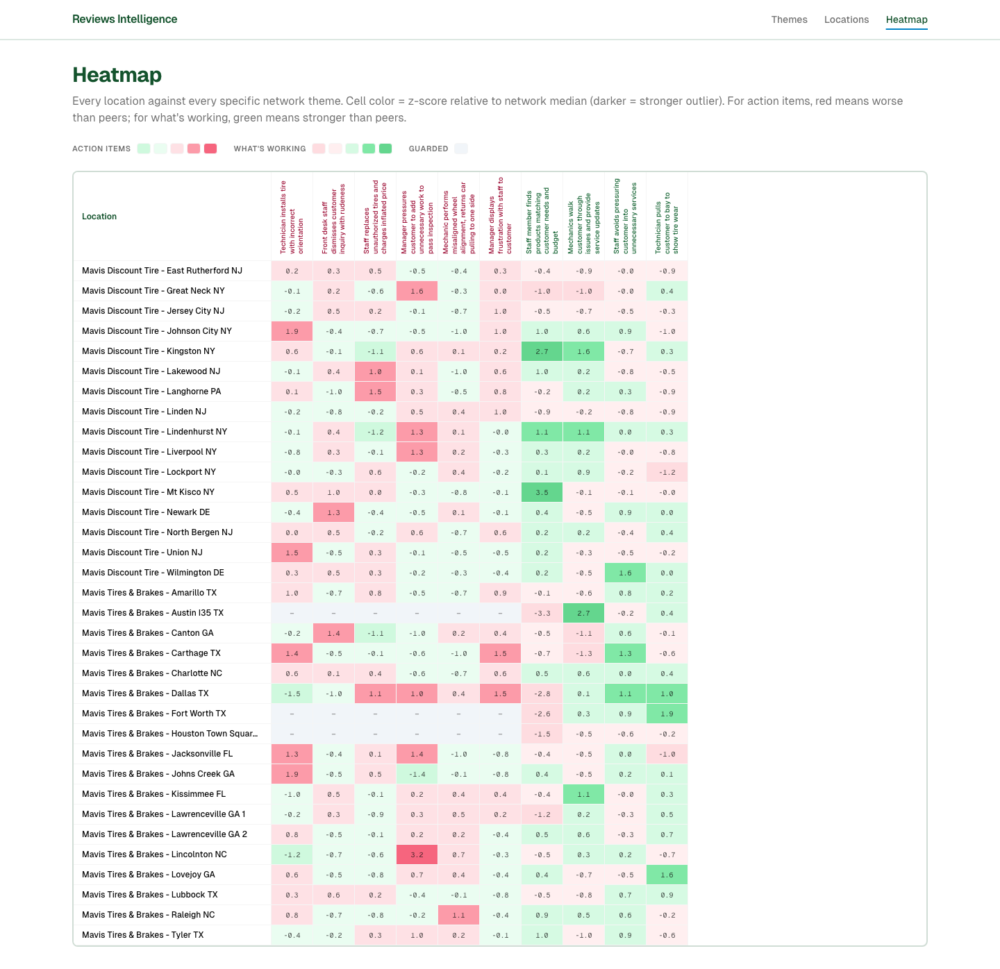

# Reviews Intelligence

**Turn thousands of messy Google and Yelp reviews into per-location action briefs a store manager can act on Monday morning.**

**[▶ Live demo](https://reviews-project-iota.vercel.app/)**  ·  **[▶ Demo video (MCP)](https://www.loom.com/share/c0901ef1e61445289a92cbf12efca470)**  ·  [Architecture](ARCHITECTURE.md)  ·  [Design decisions](DECISIONS.md)  ·  [Evaluation](evals/README.md)

A review-intelligence tool for multi-location businesses, built as a demo on
**Mavis** (a ~34-store tire-shop network). It scrapes ~19,000 Google + Yelp
reviews, embeds and clusters them into recurring themes, scores each location
against the network, detects anomalies and trends, and uses Claude to generate
a manager brief per store. The same data is exposed three ways: a **web
dashboard**, a **read-only MCP server** you can query from Claude in natural
language, and the **Postgres database** itself.

> **Scope:** demo build, no auth. The interesting work is the data pipeline,
> the evaluation rigor, and the AI system design — not the login screen.



---

## What this demonstrates

If you're evaluating this repo, these are the parts worth your time:

- **An eval-first approach to LLM output.** Before building the brief
  generator, three locations were hand-labeled into rigorous ground-truth
  briefs to grade against. See **[`evals/`](evals/README.md)** — this is the
  most important folder.
- **The decisions, not just the result.** **[`DECISIONS.md`](DECISIONS.md)** is
  the engineering log — alternatives tried and rejected, the bugs that shaped
  the design, and what was deliberately deferred and why.
- **A real analytics layer, not just RAG.** Reviews are clustered into themes,
  each location is scored for prevalence, and robust z-scores surface where a
  store is an outlier versus the network. See
  **[`ARCHITECTURE.md`](ARCHITECTURE.md)**.
- **Trust-boundary discipline with LLMs.** Every quote in a brief is validated
  as a verbatim substring of a real review — no paraphrase can slip through.
  Semantic search returns honest empties instead of inventing reviews.
- **Production judgment on a demo budget.** Two-phase ELT so a normalizer bug
  never re-pays the scraping vendor; cost guardrails and `--dry-run` on every
  paid step; idempotent re-runnable jobs; a fully reproducible schema via
  migrations.
- **An agent-ready interface.** An 8-tool MCP server lets Claude Desktop answer
  "what should the Charlotte manager focus on?" by calling into the data.

## Architecture at a glance



Six pipeline stages (ingest → embed → cluster → label → score → brief), each a
standalone, re-runnable Python script. Full detail, including every model
choice and statistical threshold, is in **[`ARCHITECTURE.md`](ARCHITECTURE.md)**.

| | |
|---|---|
| **Per-location manager brief** (Claude Opus, evidence-cited) |  |
| **Network anomaly heatmap** (robust z-scores) |  |

## Stack

- **Web** — Next.js 14 (App Router, TypeScript, Tailwind, shadcn/ui), deployed on Vercel
- **Data** — Supabase (Postgres + pgvector); schema managed as Supabase CLI migrations
- **Pipeline** — Python (`scripts/`)
- **AI** — Anthropic Claude (Opus for briefs, Haiku for theme labeling); OpenAI `text-embedding-3-large` truncated to 1536 dims
- **Ingestion** — Bright Data Web Scraper API
- **Agent interface** — Model Context Protocol server (FastMCP, stdio)

## Data model

10 tables + a rollup view, all documented in
**[`supabase/SCHEMA.md`](supabase/SCHEMA.md)**. Core flow: `locations` →
`reviews` (with a `vector(1536)` embedding) → `themes` → `location_theme_scores`
/ `trends` → `briefs`. The executable schema lives in
[`supabase/migrations/`](supabase/migrations/).

## Quickstart

```bash
# 1. Environment
cp .env.example .env.local          # fill in Supabase / Anthropic / OpenAI / Bright Data keys

# 2. Database — apply the schema (requires the Supabase CLI + Docker)
supabase link --project-ref <your-project-ref>
supabase db push                    # runs every migration in supabase/migrations/

# 3. Web app
npm install
npm run dev                         # http://localhost:3000

# 4. Data pipeline — see scripts/README.md
```

The full pipeline (scrape → embed → cluster → label → analyze → brief) is
documented in **[`scripts/README.md`](scripts/README.md)**. Every paid step has
a `--dry-run` flag.

## Cost profile

The whole dataset is cheap to (re)build: embedding ~19k reviews ≈ **$0.25**,
theme labeling runs on Claude Haiku with prompt caching, and each manager brief
is a single Claude Opus call with its real cost recorded in `briefs.cost_usd`.
Scraping is the only meaningful cost and is paid once, then cached to disk.

## Querying it with Claude (MCP)

[`scripts/mcp_server.py`](scripts/mcp_server.py) exposes the dataset as 8
read-only tools (`list_locations`, `search_reviews`, `get_location_brief`,
`get_location_anomalies`, `get_theme_prevalence`, …) so Claude can answer
questions like *"Which stores are worst on the unauthorized-work theme, and what
should they do?"* by chaining tools and citing real reviews.

**[▶ Watch it in action](https://www.loom.com/share/c0901ef1e61445289a92cbf12efca470)** —
the easiest way to see it without running anything.

It is a **local stdio server**, not a hosted service: Claude Desktop launches it
as a subprocess on your machine. There is no public endpoint. To run it yourself
you need this repo, the Python venv, and **your own database credentials** in
`.env.local` — the server authenticates with a Supabase service-role key, so it
can't be shared as-is.

<details>
<summary>Local setup</summary>

Add to `~/Library/Application Support/Claude/claude_desktop_config.json`, then
restart Claude Desktop:

```json
{
  "mcpServers": {
    "reviews-intelligence": {
      "command": "/abs/path/to/repo/scripts/.venv/bin/python",
      "args": ["-m", "scripts.mcp_server"],
      "env": { "PYTHONPATH": "/abs/path/to/repo" }
    }
  }
}
```
</details>

Making it usable from a link (remote transport + auth, rather than a local
subprocess) is a documented next step — see [`ARCHITECTURE.md`](ARCHITECTURE.md).

## Repo layout

```
src/             Next.js app (dashboard, API routes, lib clients)
scripts/         Python pipeline + MCP server  — see scripts/README.md
  lib/           shared clients (db, openai, anthropic, brightdata, search, …)
supabase/        migrations/ (executable schema) + SCHEMA.md (data dictionary)
evals/           ground-truth briefs + eval methodology  — see evals/README.md
docs/            decision logs (phase debriefs, scraper field mapping)
data/            locations.json
```

## License

[MIT](LICENSE).
